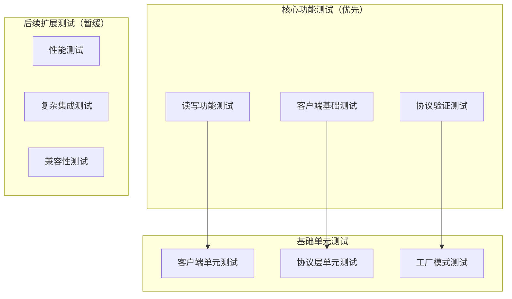
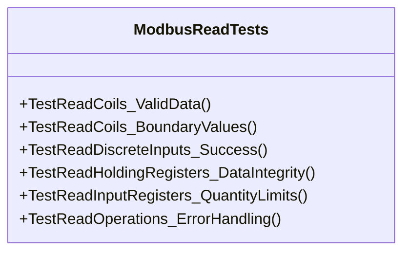
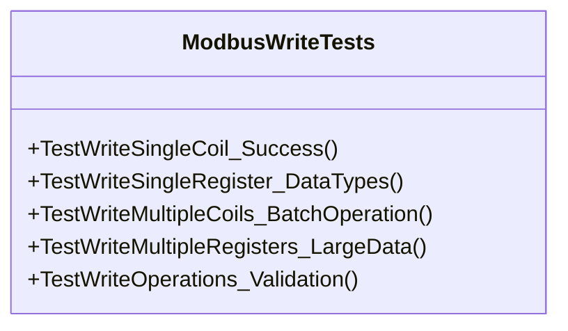
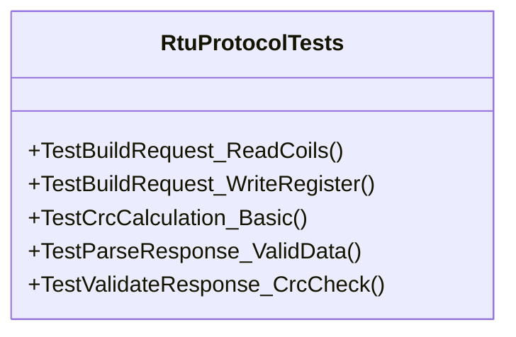
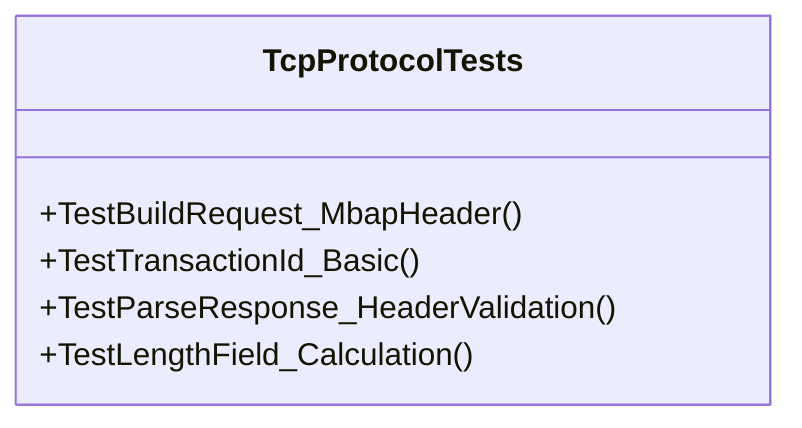
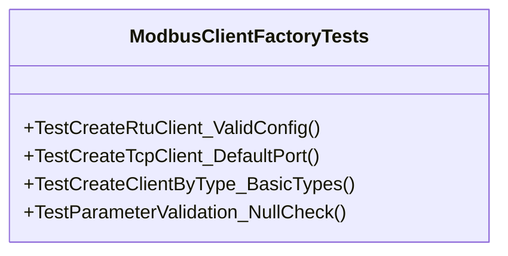
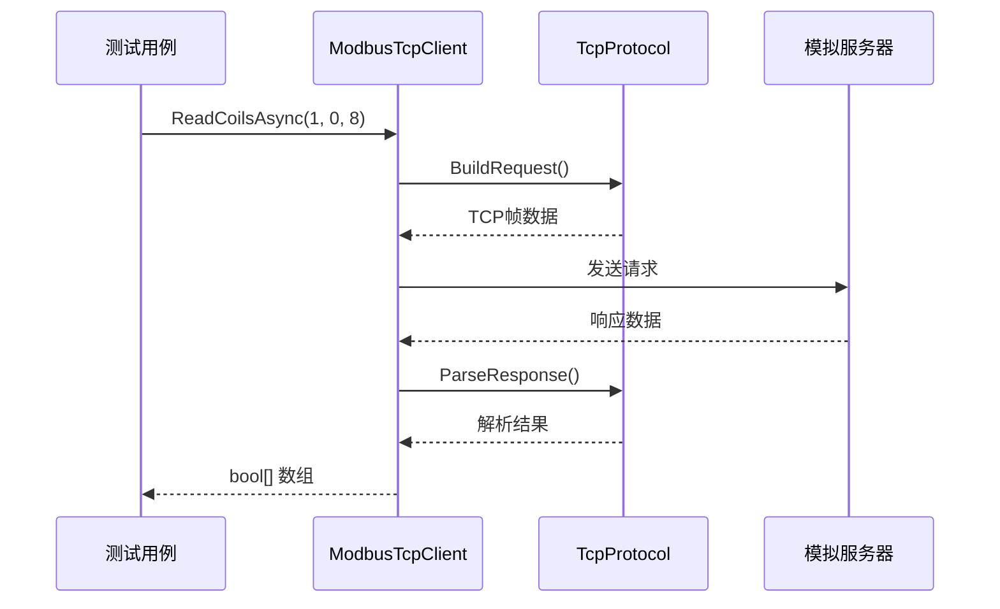
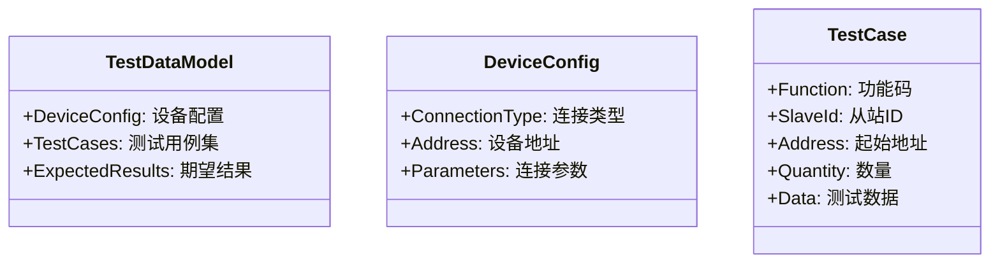

# ModbusLib 完整功能测试设计

## 概述

本文档设计了 ModbusLib 项目的功能测试方案，重点关注 Modbus 核心读写功能的正确性和稳定性。测试优先覆盖基础的读写操作，确保核心功能可靠运行。

## 测试架构

### 测试分层架构



### 测试技术栈

| 测试类型 | 测试框架 | Mock 框架 | 断言库 |
|----------|----------|-----------|--------|
| 单元测试 | xUnit | Moq | FluentAssertions |
| 基础功能测试 | xUnit | 简单Mock | FluentAssertions |

## 核心读写功能测试（优先级）

### Modbus 读取功能测试

优先测试所有 Modbus 读取功能，确保数据获取的准确性。



#### 读取线圈测试 (ReadCoils)

**测试用例：**

1. **正常读取测试**
   ```
   测试参数：
   - 从站ID: 1
   - 起始地址: 0
   - 数量: 8
   
   验证点：
   - 返回 bool[] 数组
   - 数组长度 = 8
   - 数据类型正确
   ```

2. **边界值测试**
   ```
   最小数量: 1
   最大数量: 2000
   地址范围: 0-65535
   ```

3. **异常情况测试**
   ```
   - 数量 = 0 → ArgumentException
   - 数量 > 2000 → ArgumentException
   - 非法地址 → ModbusException
   ```

#### 读取寄存器测试 (ReadHoldingRegisters)

**核心测试场景：**

1. **数据完整性测试**
   ```
   测试步骤：
   1. 读取多个寄存器值
   2. 验证返回数据类型
   3. 检查字节序转换
   4. 验证数值精度
   ```

2. **数量限制测试**
   ```
   有效范围: 1-125 个寄存器
   超出限制: > 125 → ArgumentException
   ```

### Modbus 写入功能测试

测试所有写入操作的正确性和数据一致性。



#### 写单个线圈测试 (WriteSingleCoil)

**测试用例：**

1. **基础写入测试**
   ```
   测试数据：
   - 写入 true 值
   - 写入 false 值
   
   验证方式：
   - 写入后立即读取
   - 比较写入与读取值
   ```

2. **数据转换测试**
   ```
   bool -> byte 转换：
   - true → 0xFF00
   - false → 0x0000
   ```

#### 写多个寄存器测试 (WriteMultipleRegisters)

**批量操作测试：**

1. **小数据量测试**
   ```
   数据量: 5 个寄存器
   测试值: [100, 200, 300, 400, 500]
   验证: 逐个读取对比
   ```

2. **数据边界测试**
   ```
   最大数量: 123 个寄存器
   数值范围: 0-65535
   特殊值: 0, 32767, 65535
   ```

### 读写组合测试

测试复杂的读写操作组合和数据一致性。

#### 读写多个寄存器测试 (ReadWriteMultipleRegisters)

**复合操作测试：**

```
操作参数：
- 读取起始地址: 0
- 读取数量: 10
- 写入起始地址: 100
- 写入数据: [1000, 2000, 3000]

验证步骤：
1. 执行读写操作
2. 验证读取结果
3. 单独读取写入区域验证
4. 确认数据一致性
```

### 协议层单元测试

#### RTU协议测试 (RtuProtocolTests)

重点测试 RTU 协议的核心功能：



**核心测试点：**
- CRC16 校验算法正确性
- 请求帧构建格式
- 响应解析数据完整性

#### TCP协议测试 (TcpProtocolTests)

测试 TCP 协议的 MBAP 头部处理：



**核心测试点：**
- MBAP 头部构建
- 事务ID管理
- 长度字段计算

### 工厂模式测试 (ModbusClientFactoryTests)

测试客户端创建的正确性：



**测试覆盖：**
- 主要客户端类型创建
- 配置参数验证
- 默认值设置
- 基础异常情况

## 基础集成测试

### 客户端基础集成测试

针对主要客户端类型进行基础集成测试：

#### ModbusTcpClient 基础集成测试



**测试场景：**
- 基础连接建立
- 单个读写操作
- 协议解析验证
- 连接管理

### 工厂集成测试

测试工厂创建客户端的完整流程：

```
测试步骤：
1. 使用工厂创建客户端
2. 验证客户端类型
3. 测试基础连接功能
4. 执行简单读写操作
5. 清理资源
```

## 简化功能测试

### 基础功能测试套件

重点测试 Modbus 核心读写功能：


#### 连接管理测试

```
测试步骤：
1. 使用工厂创建客户端
2. 配置连接参数
3. 执行连接操作
4. 验证连接状态
5. 执行断开操作

预期结果：
- 连接成功返回 true
- IsConnected 属性正确
- 断开连接完整清理资源
```

#### 读取功能测试

```
测试场景：读取线圈状态

测试数据：
- 从站ID: 1
- 起始地址: 0
- 数量: 16

验证点：
- 返回数据类型正确
- 数据长度匹配请求
- 值的准确性
```

#### 写入功能测试

```
测试场景：写入多个寄存器

测试数据：
- 从站ID: 1
- 起始地址: 100
- 写入值: [1000, 2000, 3000]

验证方式：
- 写入后立即读取验证
- 数据一致性检查
```

## 测试数据管理

### 测试数据模型



### 测试数据生成

**数据生成策略：**
- 边界值生成
- 随机数据生成
- 典型业务场景数据
- 异常数据构造

**数据验证：**
- 数据完整性校验
- 业务逻辑验证
- 基础性能指标验证

## 测试报告与管理

### 测试报告

**报告内容：**
- 测试覆盖率统计
- 功能测试结果
- 性能测试指标
- 兼容性测试矩阵
- 缺陷分析报告

**报告格式：**
- HTML 交互式报告
- XML JUnit 格式
- JSON API 结果
- 图表可视化

## 测试环境搭建

### 本地开发环境

**环境要求：**
- .NET 9 SDK
- Visual Studio 2022
- 简单的 Mock 工具

**配置步骤：**
```bash
# 1. 克隆项目
git clone <repo-url>

# 2. 恢复依赖包
dotnet restore

# 3. 运行测试套件
dotnet test
```

### 测试结果管理

**结果存储：**
- 本地测试结果文件
- 测试日志记录
- 性能数据收集
- 缺陷跟踪记录

## 质量保障

### 测试覆盖率要求

| 测试类型 | 覆盖率目标 | 测量维度 |
|----------|------------|----------|
| 单元测试 | ≥ 80% | 行覆盖率 |
| 功能测试 | ≥ 70% | 功能覆盖率 |

### 质量门禁

**通过条件：**
- 所有单元测试通过
- 核心功能测试成功率 ≥ 95%
- 无高优先级缺陷
- 代码覆盖率达标

### 测试维护

**维护策略：**
- 定期更新测试用例
- 测试数据清理
- 失效测试清理

## 风险与挑战

### 技术风险

**测试环境风险：**
- 网络环境依赖
- 模拟器的限制
- 并发测试的复杂性

### 解决方案

**Mock与模拟：**
- 简单的网络 Mock
- 基础设备行为模拟
- 参数验证模拟

**环境简化：**
- 本地单元测试优先
- 减少外部依赖
- 简化测试配置


