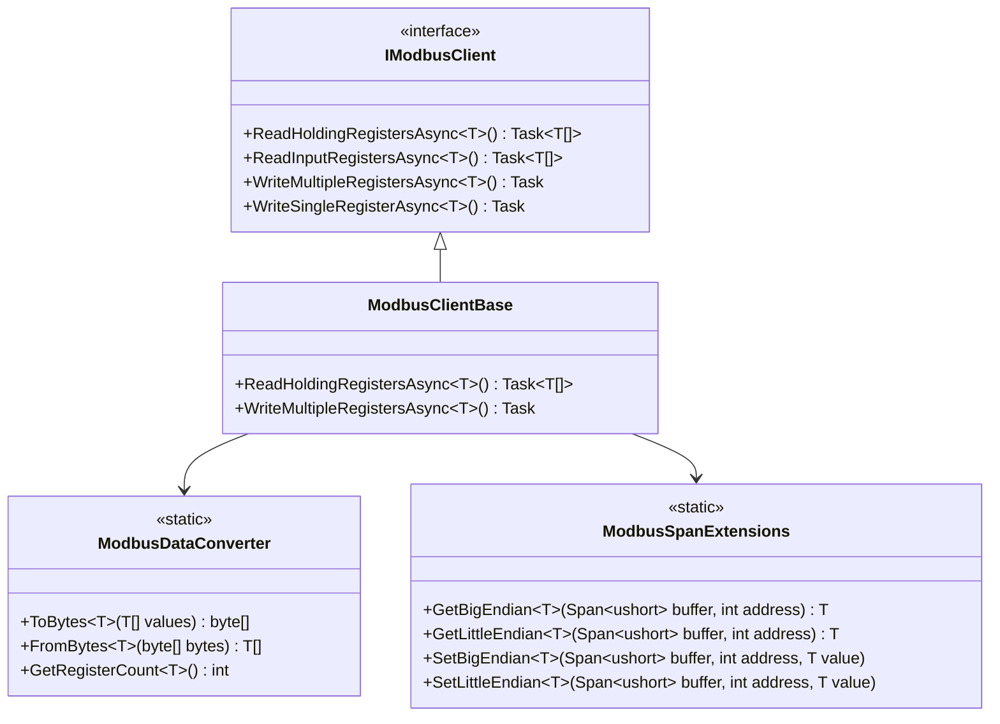
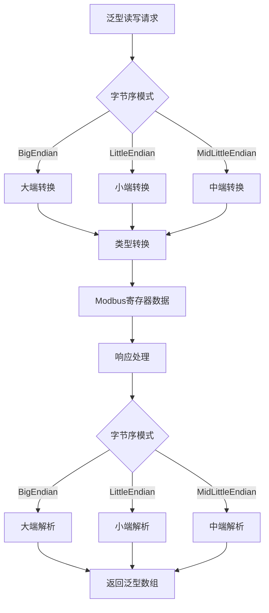
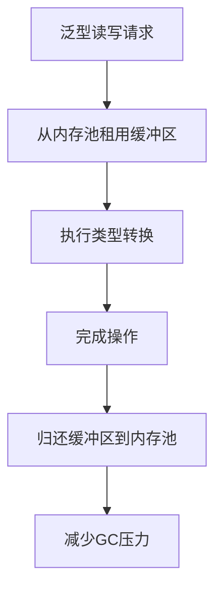

# 泛型读写功能设计

## 概述

本设计基于FluentModbus的泛型读写功能，为ModbusLib增加类型安全且高性能的泛型读写操作支持。通过引入泛型方法和扩展方法，用户可以直接读写各种数据类型（如int、float、double等），而无需手动进行字节数组转换。

## 技术栈

- .NET 9
- C# 12 泛型特性
- Span<T> 和 Memory<T> 高性能内存操作
- System.Runtime.InteropServices.MemoryMarshal 类型转换

## 架构设计

### 核心组件关系



### 字节序支持架构



## 接口扩展设计

### IModbusClient 泛型接口扩展

```csharp
public interface IModbusClient : IDisposable
{
    // 现有方法保持不变...

    #region 泛型读取功能
    
    /// <summary>
    /// 泛型读取保持寄存器
    /// </summary>
    /// <typeparam name="T">数据类型 (支持 unmanaged 类型)</typeparam>
    /// <param name="slaveId">从站地址</param>
    /// <param name="startAddress">起始地址</param>
    /// <param name="count">要返回的T类型元素数量 (例如: count=10且T=byte时返回10个byte值，实际需要5个寄存器)</param>
    /// <param name="endianness">字节序模式</param>
    /// <param name="cancellationToken">取消令牌</param>
    /// <returns>指定类型的数组，长度为count</returns>
    Task<T[]> ReadHoldingRegistersAsync<T>(byte slaveId, ushort startAddress, ushort count, 
        ModbusEndianness endianness = ModbusEndianness.BigEndian, CancellationToken cancellationToken = default) 
        where T : unmanaged;
    
    /// <summary>
    /// 泛型读取输入寄存器
    /// </summary>
    /// <typeparam name="T">数据类型 (支持 unmanaged 类型)</typeparam>
    /// <param name="slaveId">从站地址</param>
    /// <param name="startAddress">起始地址</param>
    /// <param name="count">要返回的T类型元素数量 (例如: count=10且T=byte时返回10个byte值，实际需要5个寄存器)</param>
    /// <param name="endianness">字节序模式</param>
    /// <param name="cancellationToken">取消令牌</param>
    /// <returns>指定类型的数组，长度为count</returns>
    Task<T[]> ReadInputRegistersAsync<T>(byte slaveId, ushort startAddress, ushort count,
        ModbusEndianness endianness = ModbusEndianness.BigEndian, CancellationToken cancellationToken = default) 
        where T : unmanaged;
    
    #endregion

    #region 泛型写入功能
    
    /// <summary>
    /// 泛型写入单个寄存器
    /// </summary>
    /// <typeparam name="T">数据类型 (支持 unmanaged 类型)</typeparam>
    /// <param name="slaveId">从站地址</param>
    /// <param name="address">寄存器地址</param>
    /// <param name="value">要写入的值</param>
    /// <param name="endianness">字节序模式</param>
    /// <param name="cancellationToken">取消令牌</param>
    Task WriteSingleRegisterAsync<T>(byte slaveId, ushort address, T value,
        ModbusEndianness endianness = ModbusEndianness.BigEndian, CancellationToken cancellationToken = default) 
        where T : unmanaged;
    
    /// <summary>
    /// 泛型写入多个寄存器
    /// </summary>
    /// <typeparam name="T">数据类型 (支持 unmanaged 类型)</typeparam>
    /// <param name="slaveId">从站地址</param>
    /// <param name="startAddress">起始地址</param>
    /// <param name="values">要写入的值数组</param>
    /// <param name="endianness">字节序模式</param>
    /// <param name="cancellationToken">取消令牌</param>
    Task WriteMultipleRegistersAsync<T>(byte slaveId, ushort startAddress, T[] values,
        ModbusEndianness endianness = ModbusEndianness.BigEndian, CancellationToken cancellationToken = default) 
        where T : unmanaged;
    
    #endregion
}
```

## 核心实现组件

### 字节序枚举定义

```csharp
/// <summary>
/// Modbus字节序模式
/// </summary>
public enum ModbusEndianness
{
    /// <summary>
    /// 大端字节序 (Modbus标准, 高位字节在前)
    /// </summary>
    BigEndian,
    
    /// <summary>
    /// 小端字节序 (低位字节在前)
    /// </summary>
    LittleEndian,
    
    /// <summary>
    /// 中端字节序 (字内小端，字间大端)
    /// </summary>
    MidLittleEndian
}
```

### 数据转换器设计

```csharp
/// <summary>
/// Modbus数据类型转换器
/// </summary>
public static class ModbusDataConverter
{
    /// <summary>
    /// 计算指定类型需要的寄存器数量
    /// </summary>
    /// <typeparam name="T">数据类型</typeparam>
    /// <returns>寄存器数量</returns>
    public static int GetRegisterCount<T>() where T : unmanaged
    {
        return (Unsafe.SizeOf<T>() + 1) / 2; // 向上取整
    }
    
    /// <summary>
    /// 计算指定数量元素需要的寄存器数量
    /// </summary>
    /// <typeparam name="T">数据类型</typeparam>
    /// <param name="count">T类型元素数量</param>
    /// <returns>所需的寄存器数量 (例如: 10个byte需要5个寄存器，5个int需要10个寄存器)</returns>
    public static int GetTotalRegisterCount<T>(int count) where T : unmanaged
    {
        return (Unsafe.SizeOf<T>() * count + 1) / 2;
    }
    
    /// <summary>
    /// 将泛型数组转换为字节数组
    /// </summary>
    /// <typeparam name="T">源类型</typeparam>
    /// <param name="values">源数组</param>
    /// <param name="endianness">字节序</param>
    /// <returns>字节数组</returns>
    public static byte[] ToBytes<T>(T[] values, ModbusEndianness endianness = ModbusEndianness.BigEndian) 
        where T : unmanaged
    {
        var byteCount = Unsafe.SizeOf<T>() * values.Length;
        var buffer = ArrayPool<byte>.Shared.Rent(byteCount);
        
        try
        {
            var span = buffer.AsSpan(0, byteCount);
            var sourceSpan = MemoryMarshal.Cast<T, byte>(values.AsSpan());
            sourceSpan.CopyTo(span);
            
            // 根据字节序调整
            ApplyEndianness<T>(span, endianness);
            
            return span.ToArray();
        }
        finally
        {
            ArrayPool<byte>.Shared.Return(buffer);
        }
    }
    
    /// <summary>
    /// 将字节数组转换为泛型数组
    /// </summary>
    /// <typeparam name="T">目标类型</typeparam>
    /// <param name="bytes">源字节数组</param>
    /// <param name="count">元素数量</param>
    /// <param name="endianness">字节序</param>
    /// <returns>泛型数组</returns>
    public static T[] FromBytes<T>(byte[] bytes, int count, ModbusEndianness endianness = ModbusEndianness.BigEndian) 
        where T : unmanaged
    {
        var expectedSize = Unsafe.SizeOf<T>() * count;
        if (bytes.Length < expectedSize)
            throw new ArgumentException($"字节数组长度不足，需要 {expectedSize} 字节，实际 {bytes.Length} 字节");
            
        var workingBuffer = ArrayPool<byte>.Shared.Rent(expectedSize);
        try
        {
            var span = workingBuffer.AsSpan(0, expectedSize);
            bytes.AsSpan(0, expectedSize).CopyTo(span);
            
            // 根据字节序调整
            ApplyEndianness<T>(span, endianness);
            
            var resultSpan = MemoryMarshal.Cast<byte, T>(span);
            return resultSpan[..count].ToArray();
        }
        finally
        {
            ArrayPool<byte>.Shared.Return(workingBuffer);
        }
    }
    
    /// <summary>
    /// 应用字节序转换
    /// </summary>
    private static void ApplyEndianness<T>(Span<byte> data, ModbusEndianness endianness) where T : unmanaged
    {
        var typeSize = Unsafe.SizeOf<T>();
        
        switch (endianness)
        {
            case ModbusEndianness.BigEndian:
                // Modbus标准字节序，需要转换
                for (int i = 0; i < data.Length; i += typeSize)
                {
                    var elementSpan = data.Slice(i, Math.Min(typeSize, data.Length - i));
                    if (BitConverter.IsLittleEndian && elementSpan.Length >= 2)
                        elementSpan.Reverse();
                }
                break;
                
            case ModbusEndianness.LittleEndian:
                // 保持原样 (系统默认)
                break;
                
            case ModbusEndianness.MidLittleEndian:
                // 字内小端，字间大端
                ApplyMidLittleEndian(data, typeSize);
                break;
        }
    }
    
    /// <summary>
    /// 应用中端字节序转换
    /// </summary>
    private static void ApplyMidLittleEndian(Span<byte> data, int typeSize)
    {
        // 实现中端字节序转换逻辑
        for (int i = 0; i < data.Length; i += 4) // 假设以32位为单位
        {
            if (i + 3 < data.Length)
            {
                // 交换字的顺序，但保持字内字节顺序
                (data[i], data[i + 2]) = (data[i + 2], data[i]);
                (data[i + 1], data[i + 3]) = (data[i + 3], data[i + 1]);
            }
        }
    }
}
```

### Span扩展方法设计

```csharp
/// <summary>
/// Modbus Span扩展方法
/// </summary>
public static class ModbusSpanExtensions  
{
    /// <summary>
    /// 从寄存器缓冲区读取大端格式的值
    /// </summary>
    /// <typeparam name="T">值类型</typeparam>
    /// <param name="buffer">寄存器缓冲区</param>
    /// <param name="address">寄存器地址</param>
    /// <returns>读取的值</returns>
    public static T GetBigEndian<T>(this Span<ushort> buffer, int address) where T : unmanaged
    {
        var typeSize = Unsafe.SizeOf<T>();
        var registerCount = (typeSize + 1) / 2;
        
        if (address + registerCount > buffer.Length)
            throw new ArgumentOutOfRangeException(nameof(address), "地址超出缓冲区范围");
            
        var registers = buffer.Slice(address, registerCount);
        var byteBuffer = ArrayPool<byte>.Shared.Rent(typeSize);
        
        try
        {
            var byteSpan = byteBuffer.AsSpan(0, typeSize);
            
            // 将寄存器转换为大端字节序
            for (int i = 0; i < registerCount; i++)
            {
                var reg = registers[i];
                var baseIndex = i * 2;
                if (baseIndex < byteSpan.Length)
                    byteSpan[baseIndex] = (byte)(reg >> 8);
                if (baseIndex + 1 < byteSpan.Length)
                    byteSpan[baseIndex + 1] = (byte)(reg & 0xFF);
            }
            
            return MemoryMarshal.Read<T>(byteSpan);
        }
        finally
        {
            ArrayPool<byte>.Shared.Return(byteBuffer);
        }
    }
    
    /// <summary>
    /// 从寄存器缓冲区读取小端格式的值
    /// </summary>
    /// <typeparam name="T">值类型</typeparam>
    /// <param name="buffer">寄存器缓冲区</param>
    /// <param name="address">寄存器地址</param>
    /// <returns>读取的值</returns>
    public static T GetLittleEndian<T>(this Span<ushort> buffer, int address) where T : unmanaged
    {
        var typeSize = Unsafe.SizeOf<T>();
        var registerCount = (typeSize + 1) / 2;
        
        if (address + registerCount > buffer.Length)
            throw new ArgumentOutOfRangeException(nameof(address), "地址超出缓冲区范围");
            
        var registers = buffer.Slice(address, registerCount);
        var byteBuffer = ArrayPool<byte>.Shared.Rent(typeSize);
        
        try
        {
            var byteSpan = byteBuffer.AsSpan(0, typeSize);
            
            // 将寄存器转换为小端字节序
            for (int i = 0; i < registerCount; i++)
            {
                var reg = registers[i];
                var baseIndex = i * 2;
                if (baseIndex < byteSpan.Length)
                    byteSpan[baseIndex] = (byte)(reg & 0xFF);
                if (baseIndex + 1 < byteSpan.Length)
                    byteSpan[baseIndex + 1] = (byte)(reg >> 8);
            }
            
            return MemoryMarshal.Read<T>(byteSpan);
        }
        finally
        {
            ArrayPool<byte>.Shared.Return(byteBuffer);
        }
    }
    
    /// <summary>
    /// 向寄存器缓冲区写入大端格式的值
    /// </summary>
    /// <typeparam name="T">值类型</typeparam>
    /// <param name="buffer">寄存器缓冲区</param>
    /// <param name="address">寄存器地址</param>
    /// <param name="value">要写入的值</param>
    public static void SetBigEndian<T>(this Span<ushort> buffer, int address, T value) where T : unmanaged
    {
        var typeSize = Unsafe.SizeOf<T>();
        var registerCount = (typeSize + 1) / 2;
        
        if (address + registerCount > buffer.Length)
            throw new ArgumentOutOfRangeException(nameof(address), "地址超出缓冲区范围");
            
        var byteBuffer = ArrayPool<byte>.Shared.Rent(typeSize);
        
        try
        {
            var byteSpan = byteBuffer.AsSpan(0, typeSize);
            MemoryMarshal.Write(byteSpan, ref value);
            
            var registers = buffer.Slice(address, registerCount);
            
            // 将字节转换为大端寄存器格式
            for (int i = 0; i < registerCount; i++)
            {
                var baseIndex = i * 2;
                ushort register = 0;
                
                if (baseIndex < byteSpan.Length)
                    register = (ushort)(byteSpan[baseIndex] << 8);
                if (baseIndex + 1 < byteSpan.Length)
                    register |= byteSpan[baseIndex + 1];
                    
                registers[i] = register;
            }
        }
        finally
        {
            ArrayPool<byte>.Shared.Return(byteBuffer);
        }
    }
    
    /// <summary>
    /// 向寄存器缓冲区写入小端格式的值
    /// </summary>
    /// <typeparam name="T">值类型</typeparam>
    /// <param name="buffer">寄存器缓冲区</param>
    /// <param name="address">寄存器地址</param>
    /// <param name="value">要写入的值</param>
    public static void SetLittleEndian<T>(this Span<ushort> buffer, int address, T value) where T : unmanaged
    {
        var typeSize = Unsafe.SizeOf<T>();
        var registerCount = (typeSize + 1) / 2;
        
        if (address + registerCount > buffer.Length)
            throw new ArgumentOutOfRangeException(nameof(address), "地址超出缓冲区范围");
            
        var byteBuffer = ArrayPool<byte>.Shared.Rent(typeSize);
        
        try
        {
            var byteSpan = byteBuffer.AsSpan(0, typeSize);
            MemoryMarshal.Write(byteSpan, ref value);
            
            var registers = buffer.Slice(address, registerCount);
            
            // 将字节转换为小端寄存器格式
            for (int i = 0; i < registerCount; i++)
            {
                var baseIndex = i * 2;
                ushort register = 0;
                
                if (baseIndex < byteSpan.Length)
                    register = byteSpan[baseIndex];
                if (baseIndex + 1 < byteSpan.Length)
                    register |= (ushort)(byteSpan[baseIndex + 1] << 8);
                    
                registers[i] = register;
            }
        }
        finally
        {
            ArrayPool<byte>.Shared.Return(byteBuffer);
        }
    }
}
```

## 客户端基类实现

### ModbusClientBase 泛型方法实现

在ModbusClientBase中实现泛型读写方法：

```csharp
public abstract partial class ModbusClientBase : IModbusClient
{
    #region 泛型读取实现
    
    /// <summary>
    /// 泛型读取保持寄存器实现
    /// </summary>
    public virtual async Task<T[]> ReadHoldingRegistersAsync<T>(byte slaveId, ushort startAddress, ushort count,
        ModbusEndianness endianness = ModbusEndianness.BigEndian, CancellationToken cancellationToken = default) 
        where T : unmanaged
    {
        ValidateGenericReadParameters<T>(count);
        
        // 计算实际需要读取的寄存器数量
        var registerCount = ModbusDataConverter.GetTotalRegisterCount<T>(count);
        if (registerCount > 125)
            throw new ArgumentException($"读取 {count} 个 {typeof(T).Name} 类型元素需要 {registerCount} 个寄存器，超过限制 (125)");
            
        // 调用现有的ushort[]读取方法，读取实际需要的寄存器数量
        var registers = await ReadHoldingRegistersAsync(slaveId, startAddress, (ushort)registerCount, cancellationToken);
        
        // 转换为字节数组然后转换为目标类型，返回指定数量的T类型元素
        var bytes = ModbusUtils.UshortArrayToByteArray(registers);
        return ModbusDataConverter.FromBytes<T>(bytes, count, endianness);
    }
    
    /// <summary>
    /// 泛型读取输入寄存器实现
    /// </summary>
    public virtual async Task<T[]> ReadInputRegistersAsync<T>(byte slaveId, ushort startAddress, ushort count,
        ModbusEndianness endianness = ModbusEndianness.BigEndian, CancellationToken cancellationToken = default) 
        where T : unmanaged
    {
        ValidateGenericReadParameters<T>(count);
        
        // 计算实际需要读取的寄存器数量
        var registerCount = ModbusDataConverter.GetTotalRegisterCount<T>(count);
        if (registerCount > 125)
            throw new ArgumentException($"读取 {count} 个 {typeof(T).Name} 类型元素需要 {registerCount} 个寄存器，超过限制 (125)");
            
        // 调用现有的ushort[]读取方法，读取实际需要的寄存器数量
        var registers = await ReadInputRegistersAsync(slaveId, startAddress, (ushort)registerCount, cancellationToken);
        
        // 转换为字节数组然后转换为目标类型，返回指定数量的T类型元素
        var bytes = ModbusUtils.UshortArrayToByteArray(registers);
        return ModbusDataConverter.FromBytes<T>(bytes, count, endianness);
    }
    
    #endregion

    #region 泛型写入实现
    
    /// <summary>
    /// 泛型写入单个寄存器实现
    /// </summary>
    public virtual async Task WriteSingleRegisterAsync<T>(byte slaveId, ushort address, T value,
        ModbusEndianness endianness = ModbusEndianness.BigEndian, CancellationToken cancellationToken = default) 
        where T : unmanaged
    {
        var registerCount = ModbusDataConverter.GetRegisterCount<T>();
        if (registerCount != 1)
            throw new ArgumentException($"类型 {typeof(T).Name} 需要 {registerCount} 个寄存器，无法使用单寄存器写入");
            
        var bytes = ModbusDataConverter.ToBytes(new[] { value }, endianness);
        var registers = ModbusUtils.ByteArrayToUshortArray(bytes);
        
        await WriteSingleRegisterAsync(slaveId, address, registers[0], cancellationToken);
    }
    
    /// <summary>
    /// 泛型写入多个寄存器实现
    /// </summary>
    public virtual async Task WriteMultipleRegistersAsync<T>(byte slaveId, ushort startAddress, T[] values,
        ModbusEndianness endianness = ModbusEndianness.BigEndian, CancellationToken cancellationToken = default) 
        where T : unmanaged
    {
        if (values == null || values.Length == 0)
            throw new ArgumentException("值数组不能为空");
            
        var registerCount = ModbusDataConverter.GetTotalRegisterCount<T>(values.Length);
        if (registerCount > 123)
            throw new ArgumentException($"请求的寄存器数量 ({registerCount}) 超过限制 (123)");
            
        var bytes = ModbusDataConverter.ToBytes(values, endianness);
        var registers = ModbusUtils.ByteArrayToUshortArray(bytes);
        
        await WriteMultipleRegistersAsync(slaveId, startAddress, registers, cancellationToken);
    }
    
    #endregion
    
    #region 参数验证辅助方法
    
    /// <summary>
    /// 验证泛型读取参数
    /// </summary>
    private static void ValidateGenericReadParameters<T>(ushort count) where T : unmanaged
    {
        if (count == 0)
            throw new ArgumentException("元素数量必须大于0", nameof(count));
            
        var typeSize = Unsafe.SizeOf<T>();
        if (typeSize % 2 != 0 && count > 1)
        {
            // 对于奇数字节大小的类型，需要特殊处理
            var totalBytes = typeSize * count;
            if (totalBytes % 2 != 0)
                throw new ArgumentException($"请求 {count} 个 {typeof(T).Name} 类型元素总共需要 {totalBytes} 字节，奇数字节总数在Modbus中不支持");
        }
    }
    
    #endregion
}
```

## 使用示例

### 读取不同数据类型

```csharp
var client = new ModbusTcpClient();
await client.ConnectAsync();

// 读取5个float值 (每个float占用2个寄存器，总共需要10个寄存器)
var floatValues = await client.ReadHoldingRegistersAsync<float>(slaveId: 1, startAddress: 0, count: 5);
Console.WriteLine($"Temperature: {floatValues[0]}°C");
Console.WriteLine($"读取到 {floatValues.Length} 个float值"); // 输出: 5

// 读取3个int值 (每个int占用2个寄存器，总共需要6个寄存器)
var intValues = await client.ReadInputRegistersAsync<int>(slaveId: 1, startAddress: 10, count: 3);
Console.WriteLine($"Counter: {intValues[0]}");
Console.WriteLine($"读取到 {intValues.Length} 个int值"); // 输出: 3

// 读取1个double值 (每个double占用4个寄存器)
var doubleValues = await client.ReadHoldingRegistersAsync<double>(slaveId: 1, startAddress: 20, count: 1);
Console.WriteLine($"Precision Value: {doubleValues[0]}");
Console.WriteLine($"读取到 {doubleValues.Length} 个double值"); // 输出: 1

// 读取10个byte值 (每2个byte占用1个寄存器，总共需要5个寄存器)
var byteValues = await client.ReadHoldingRegistersAsync<byte>(slaveId: 1, startAddress: 25, count: 10);
Console.WriteLine($"读取到 {byteValues.Length} 个byte值"); // 输出: 10

// 使用小端字节序读取2个int值
var littleEndianValues = await client.ReadHoldingRegistersAsync<int>(
    slaveId: 1, startAddress: 30, count: 2, endianness: ModbusEndianness.LittleEndian);
```

### 写入不同数据类型

```csharp
// 写入float值
await client.WriteSingleRegisterAsync<short>(slaveId: 1, address: 0, value: 1234);

// 写入多个float值
var temperatures = new float[] { 25.5f, 26.0f, 24.8f };
await client.WriteMultipleRegistersAsync(slaveId: 1, startAddress: 10, values: temperatures);

// 使用小端字节序写入
await client.WriteMultipleRegistersAsync(
    slaveId: 1, startAddress: 20, 
    values: new int[] { 100, 200, 300 }, 
    endianness: ModbusEndianness.LittleEndian);
```

### 复合数据结构支持

```csharp
// 定义复合结构体
[StructLayout(LayoutKind.Sequential, Pack = 1)]
public struct SensorData
{
    public float Temperature;    // 4字节
    public float Humidity;       // 4字节  
    public int Status;           // 4字节
    // 总共12字节，需要6个寄存器
}

// 读取结构体数据
var sensorData = await client.ReadHoldingRegistersAsync<SensorData>(
    slaveId: 1, startAddress: 0, count: 1);
    
Console.WriteLine($"Temperature: {sensorData[0].Temperature}");
Console.WriteLine($"Humidity: {sensorData[0].Humidity}");
Console.WriteLine($"Status: {sensorData[0].Status}");
```

## 性能优化策略

### 内存池优化

所有转换操作使用`ArrayPool<T>.Shared`来避免频繁的内存分配：



### 类型约束优化

使用`where T : unmanaged`约束确保只支持值类型，提高性能和类型安全性。

### 批量转换优化

对于大批量数据，使用`Span<T>`和`MemoryMarshal`进行高效的批量转换。

## 错误处理策略

### 类型安全检查

```csharp
/// <summary>
/// 验证类型是否支持Modbus传输
/// </summary>
public static class ModbusTypeValidator
{
    private static readonly HashSet<Type> SupportedTypes = new()
    {
        typeof(byte), typeof(sbyte),
        typeof(short), typeof(ushort), 
        typeof(int), typeof(uint),
        typeof(long), typeof(ulong),
        typeof(float), typeof(double),
        typeof(decimal)
    };
    
    public static void ValidateType<T>() where T : unmanaged
    {
        var type = typeof(T);
        if (!SupportedTypes.Contains(type) && !type.IsValueType)
        {
            throw new NotSupportedException($"类型 {type.Name} 不支持Modbus传输");
        }
        
        var size = Unsafe.SizeOf<T>();
        if (size > 250) // 最大125个寄存器 * 2字节
        {
            throw new ArgumentException($"类型 {type.Name} 大小 ({size} 字节) 超过Modbus限制");
        }
    }
}
```

### 字节序转换异常处理

对于不同字节序模式的错误处理和回退策略：

```csharp
public class ModbusEndiannessException : ModbusException
{
    public ModbusEndianness RequestedEndianness { get; }
    
    public ModbusEndiannessException(ModbusEndianness endianness, string message) 
        : base(message)
    {
        RequestedEndianness = endianness;
    }
}
```

## 单元测试策略

### 类型转换测试

```csharp
[Test]
public void TestGenericReadWrite_Float()
{
    // 测试float类型的读写转换
    var originalValues = new float[] { 1.5f, -2.7f, 0.0f };
    var bytes = ModbusDataConverter.ToBytes(originalValues);
    var convertedValues = ModbusDataConverter.FromBytes<float>(bytes, originalValues.Length);
    
    Assert.AreEqual(originalValues, convertedValues);
}

[Test]
public void TestByteArrayConversion()
{
    // 测试byte数组转换：10个byte需要5个寄存器
    var originalBytes = new byte[] { 1, 2, 3, 4, 5, 6, 7, 8, 9, 10 };
    var registerCount = ModbusDataConverter.GetTotalRegisterCount<byte>(originalBytes.Length);
    
    Assert.AreEqual(5, registerCount); // 10 bytes = 5 registers
    
    var bytes = ModbusDataConverter.ToBytes(originalBytes);
    var convertedBytes = ModbusDataConverter.FromBytes<byte>(bytes, originalBytes.Length);
    
    Assert.AreEqual(originalBytes, convertedBytes);
    Assert.AreEqual(10, convertedBytes.Length); // 确保返回10个byte
}

[Test] 
public void TestEndianness_Conversion()
{
    // 测试不同字节序的转换
    var value = 0x12345678;
    var bigEndianBytes = ModbusDataConverter.ToBytes(new[] { value }, ModbusEndianness.BigEndian);
    var littleEndianBytes = ModbusDataConverter.ToBytes(new[] { value }, ModbusEndianness.LittleEndian);
    
    Assert.AreNotEqual(bigEndianBytes, littleEndianBytes);
}
```

### 集成测试

```csharp  
[Test]
public async Task TestGenericClientOperations_Float()
{
    using var client = new ModbusTcpClient();
    await client.ConnectAsync();
    
    // 写入3个float测试数据 (需要6个寄存器)
    var testData = new float[] { 25.5f, 30.2f, 28.1f };
    await client.WriteMultipleRegistersAsync<float>(1, 0, testData);
    
    // 读取并验证：count=3表示读取3个float值
    var readData = await client.ReadHoldingRegistersAsync<float>(1, 0, count: 3);
    
    Assert.AreEqual(3, readData.Length); // 确保返回3个float
    CollectionAssert.AreEqual(testData, readData, new FloatComparer(0.001f));
}

[Test]
public async Task TestGenericClientOperations_Byte()
{
    using var client = new ModbusTcpClient();
    await client.ConnectAsync();
    
    // 写入10个byte测试数据 (需要5个寄存器)
    var testBytes = new byte[] { 1, 2, 3, 4, 5, 6, 7, 8, 9, 10 };
    await client.WriteMultipleRegistersAsync<byte>(1, 0, testBytes);
    
    // 读取并验证：count=10表示读取10个byte值
    var readBytes = await client.ReadHoldingRegistersAsync<byte>(1, 0, count: 10);
    
    Assert.AreEqual(10, readBytes.Length); // 确保返回10个byte
    CollectionAssert.AreEqual(testBytes, readBytes);
}
```