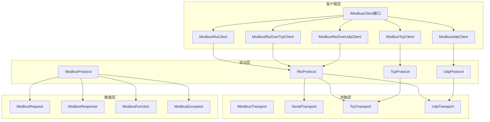
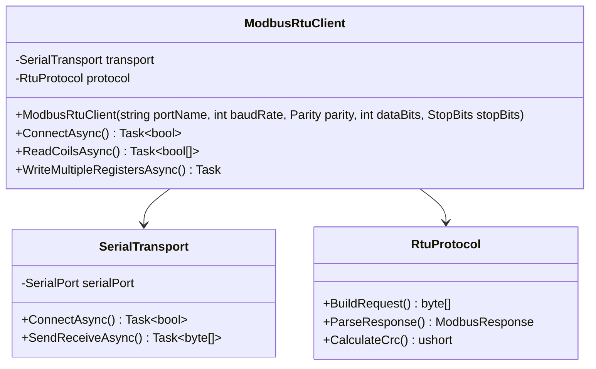
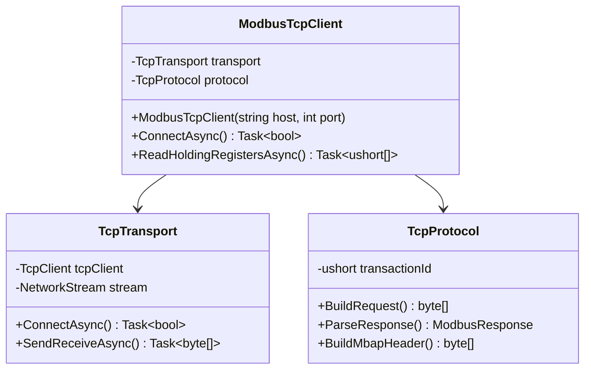
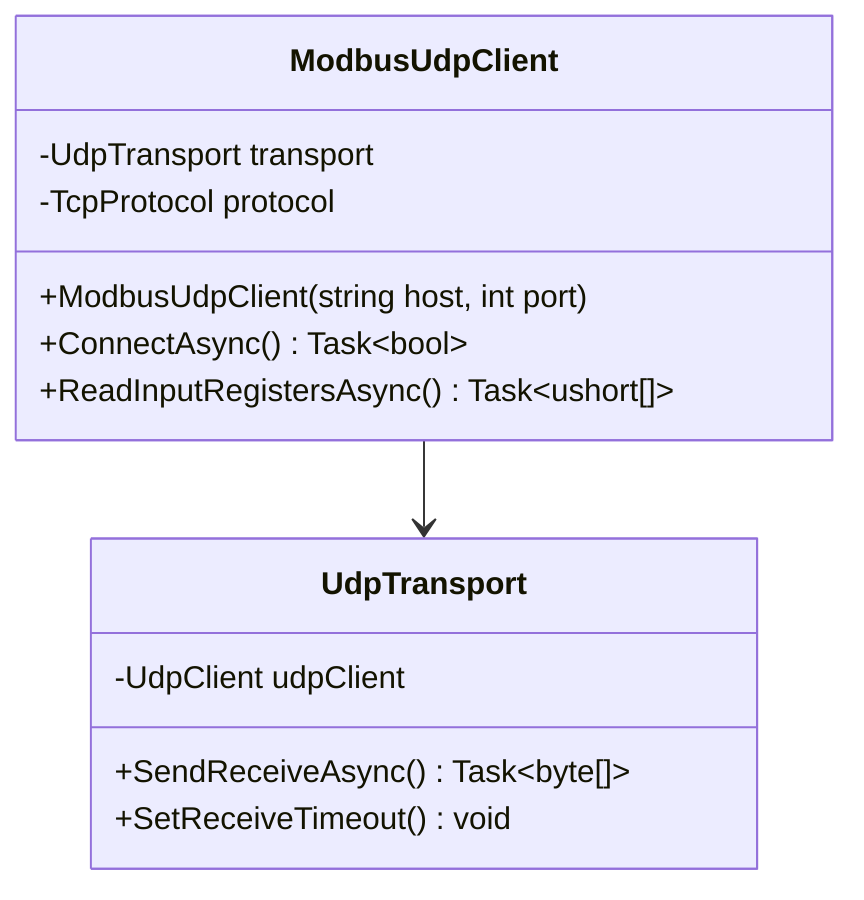
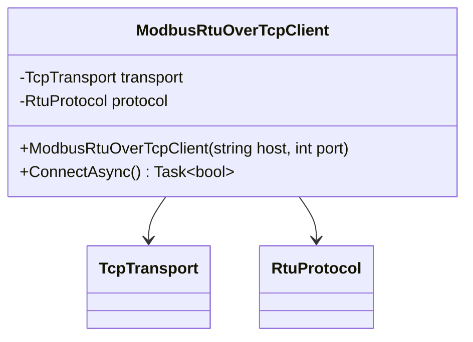
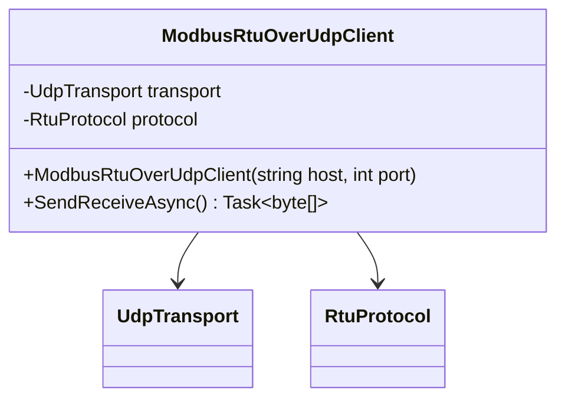
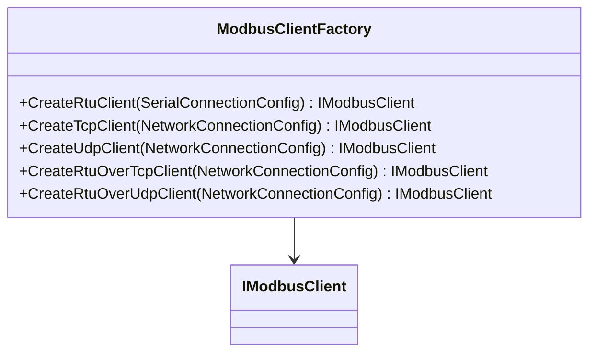

# Modbus Client Library for .NET 9 设计文档

## 1. 概述

本项目旨在开发一个功能完整、高性能的Modbus客户端库，基于.NET 9平台，支持多种Modbus协议变体。该库将提供统一的API接口，同时为不同的协议类型提供专门的客户端实现类。

### 1.1 支持的协议类型
- **Modbus RTU** - 通过串口通信的RTU协议
- **Modbus TCP** - 基于TCP/IP的标准Modbus协议  
- **Modbus UDP** - 基于UDP的Modbus协议
- **Modbus RTU over TCP** - 通过TCP传输的RTU协议
- **Modbus RTU over UDP** - 通过UDP传输的RTU协议

### 1.2 技术栈
- **.NET 9** - 目标框架
- **System.IO.Ports** - 串口通信
- **System.Net.Sockets** - 网络通信
- **System.Threading.Tasks** - 异步编程


## 2. 架构设计

### 2.1 整体架构



### 2.2 核心接口设计

#### 2.2.1 主客户端接口

```csharp
public interface IModbusClient : IDisposable
{
    // 连接管理
    Task<bool> ConnectAsync(CancellationToken cancellationToken = default);
    Task DisconnectAsync(CancellationToken cancellationToken = default);
    bool IsConnected { get; }
    
    // 读取功能
    Task<bool[]> ReadCoilsAsync(byte slaveId, ushort startAddress, ushort quantity, CancellationToken cancellationToken = default);
    Task<bool[]> ReadDiscreteInputsAsync(byte slaveId, ushort startAddress, ushort quantity, CancellationToken cancellationToken = default);
    Task<ushort[]> ReadHoldingRegistersAsync(byte slaveId, ushort startAddress, ushort quantity, CancellationToken cancellationToken = default);
    Task<ushort[]> ReadInputRegistersAsync(byte slaveId, ushort startAddress, ushort quantity, CancellationToken cancellationToken = default);
    
    // 写入功能
    Task WriteSingleCoilAsync(byte slaveId, ushort address, bool value, CancellationToken cancellationToken = default);
    Task WriteSingleRegisterAsync(byte slaveId, ushort address, ushort value, CancellationToken cancellationToken = default);
    Task WriteMultipleCoilsAsync(byte slaveId, ushort startAddress, bool[] values, CancellationToken cancellationToken = default);
    Task WriteMultipleRegistersAsync(byte slaveId, ushort startAddress, ushort[] values, CancellationToken cancellationToken = default);
    
    // 高级功能
    Task<ushort[]> ReadWriteMultipleRegistersAsync(byte slaveId, ushort readStartAddress, ushort readQuantity, 
        ushort writeStartAddress, ushort[] writeValues, CancellationToken cancellationToken = default);
    
    // 配置属性
    TimeSpan Timeout { get; set; }
    int Retries { get; set; }
}
```

#### 2.2.2 传输层接口

```csharp
public interface IModbusTransport : IDisposable
{
    Task<bool> ConnectAsync(CancellationToken cancellationToken = default);
    Task DisconnectAsync(CancellationToken cancellationToken = default);
    bool IsConnected { get; }
    
    Task<byte[]> SendReceiveAsync(byte[] request, CancellationToken cancellationToken = default);
    
    TimeSpan Timeout { get; set; }
}
```

## 3. 客户端实现类

### 3.1 ModbusRtuClient

负责处理通过串口通信的RTU协议。



**配置参数：**
- 串口名称 (COM1, COM2等)
- 波特率 (9600, 19200, 38400, 115200等)
- 校验位 (None, Even, Odd)
- 数据位 (7, 8)
- 停止位 (One, Two)

### 3.2 ModbusTcpClient

处理基于TCP/IP的标准Modbus协议。



**配置参数：**
- 主机地址 (IP地址或域名)
- 端口号 (默认502)
- 连接超时时间
- Keep-Alive配置

### 3.3 ModbusUdpClient

处理基于UDP的Modbus协议。



**特点：**
- 无连接协议
- 较低的通信开销
- 适合局域网环境
- 需要处理数据包丢失情况

### 3.4 ModbusRtuOverTcpClient

通过TCP传输RTU格式的数据。



**特点：**
- 保持RTU帧格式（包含CRC校验）
- 通过TCP可靠传输
- 兼容RTU设备的网络化

### 3.5 ModbusRtuOverUdpClient

通过UDP传输RTU格式的数据。



## 4. 协议实现层

### 4.1 协议处理类设计

#### 4.1.1 RTU协议处理

- **帧格式**: [从站地址][功能码][数据][CRC校验]
- **CRC校验**: 使用CRC-16/Modbus算法
- **超时处理**: 字符间隔超时检测
- **错误检测**: CRC校验失败重传

#### 4.1.2 TCP协议处理

- **MBAP头部**: [事务ID][协议ID][长度][单元ID]
- **事务ID管理**: 自动递增的请求标识
- **长度计算**: PDU长度自动计算
- **协议ID**: 固定为0x0000

### 4.2 Modbus功能码支持

| 功能码 | 功能描述 | 实现状态 |
|--------|----------|----------|
| 0x01 | 读取线圈状态 | ✅ |
| 0x02 | 读取离散输入状态 | ✅ |
| 0x03 | 读取保持寄存器 | ✅ |
| 0x04 | 读取输入寄存器 | ✅ |
| 0x05 | 写单个线圈 | ✅ |
| 0x06 | 写单个寄存器 | ✅ |
| 0x0F | 写多个线圈 | ✅ |
| 0x10 | 写多个寄存器 | ✅ |
| 0x17 | 读写多个寄存器 | ✅ |

## 5. 数据模型

### 5.1 请求响应模型

| 属性 | 类型 | 描述 |
|------|------|------|
| SlaveId | byte | 从站地址 |
| Function | ModbusFunction | Modbus功能码 |
| StartAddress | ushort | 起始地址 |
| Quantity | ushort | 数据量 |
| Data | byte[] | 数据内容 |
| Timestamp | DateTime | 时间戳 |
| IsError | bool | 是否错误响应 |
| Exception | ModbusException | 异常信息 |

### 5.2 异常处理

| 异常码 | 值 | 描述 |
|---------|----|---------|
| IllegalFunction | 0x01 | 非法功能码 |
| IllegalDataAddress | 0x02 | 非法数据地址 |
| IllegalDataValue | 0x03 | 非法数据值 |
| SlaveDeviceFailure | 0x04 | 从站设备故障 |
| Acknowledge | 0x05 | 确认 |
| SlaveDeviceBusy | 0x06 | 从站设备忙 |
| MemoryParityError | 0x08 | 内存校验错误 |
| GatewayPathUnavailable | 0x0A | 网关路径不可用 |
| GatewayTargetDeviceFailedToRespond | 0x0B | 网关目标设备无响应 |

## 6. 配置与连接管理

### 6.1 连接配置参数

#### 基础配置
| 参数 | 默认值 | 描述 |
|-------|----------|--------|
| Timeout | 5秒 | 超时时间 |
| Retries | 3次 | 重试次数 |
| RetryDelay | 100ms | 重试延迟 |
| AutoReconnect | true | 自动重连 |

#### 串口配置
| 参数 | 默认值 | 可选值 |
|-------|----------|----------|
| BaudRate | 9600 | 9600, 19200, 38400, 115200 |
| Parity | None | None, Even, Odd |
| DataBits | 8 | 7, 8 |
| StopBits | One | One, Two |
| Handshake | None | None, XOnXOff, RequestToSend |

#### 网络配置
| 参数 | 默认值 | 描述 |
|-------|----------|--------|
| Port | 502 | Modbus标准端口 |
| KeepAlive | true | TCP保持连接 |
| ConnectTimeout | 10秒 | 连接超时 |

### 6.2 客户端创建模式

使用工厂模式创建不同类型的Modbus客户端：



## 7. 性能优化

### 7.1 内存管理

- 使用 `ArrayPool<byte>` 减少内存分配
- 异步I/O减少线程阻塞
- 及时释放资源

### 7.2 网络优化

- TCP连接复用
- 简单重试机制
- 超时控制

### 7.3 序列化优化

- 零分配的字节操作
- 位操作优化布尔数组处理

## 8. 测试策略

### 8.1 测试类型

| 测试类型 | 目标 | 工具 |
|----------|------|------|
| 单元测试 | 各个组件功能验证 | NUnit/xUnit + Moq |
| 集成测试 | 协议兼容性测试 | Modbus模拟器 |
| 硬件测试 | 真实设备通信 | 物理设备 |
| 性能测试 | 并发连接和吞吐量 | 压力测试工具 |
| 稳定性测试 | 长时间运行 | 内存泄漏检测 |