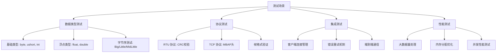
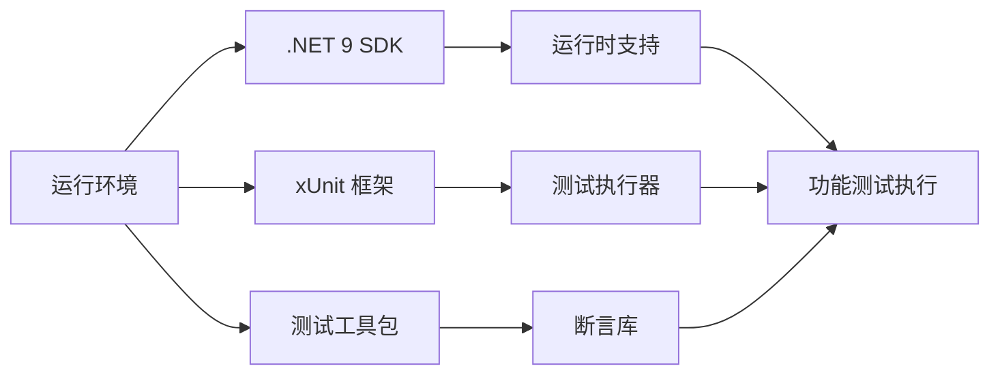
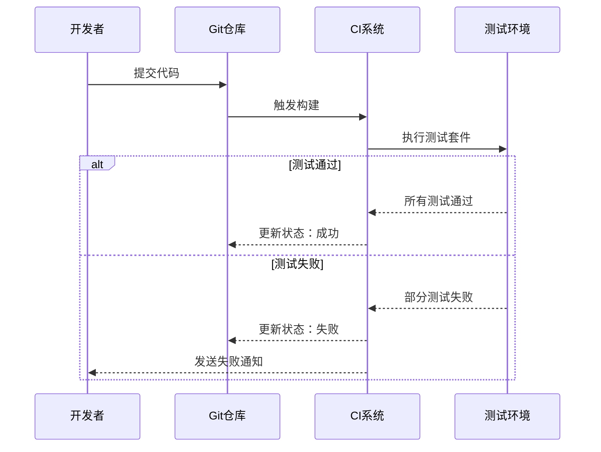
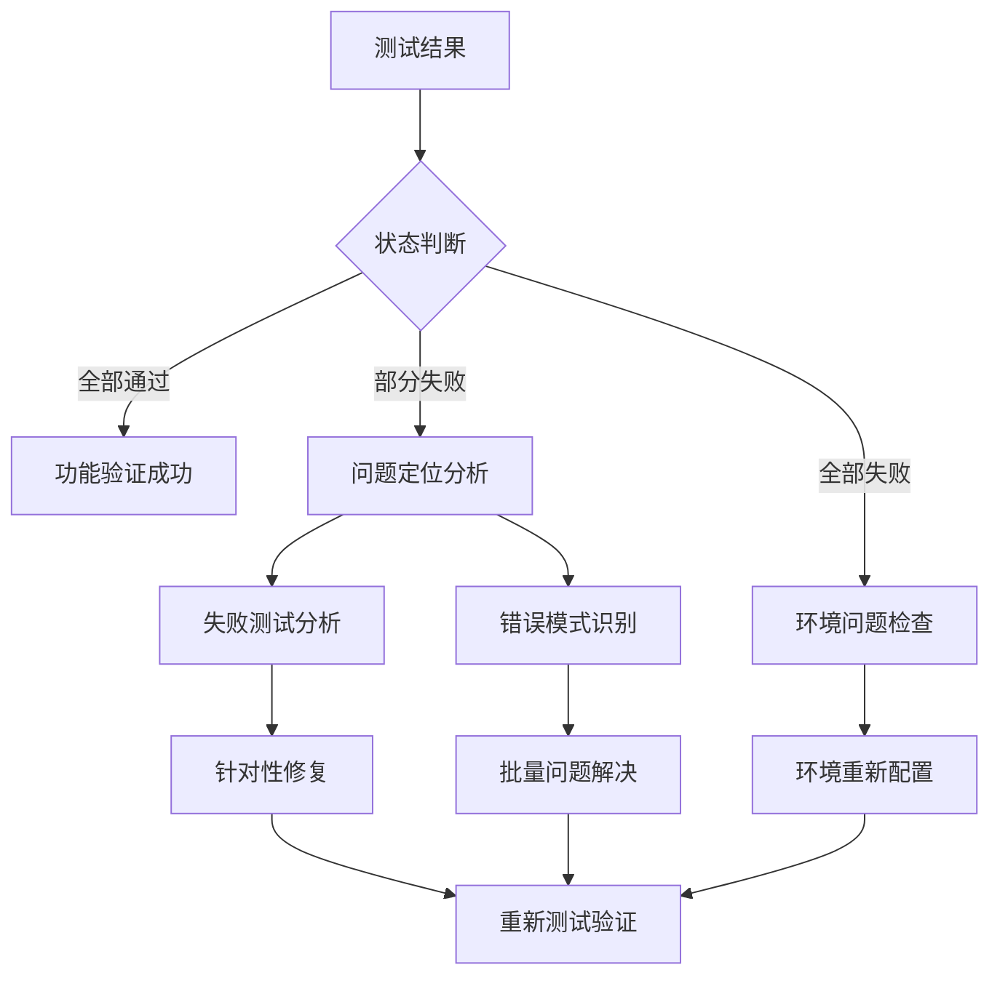
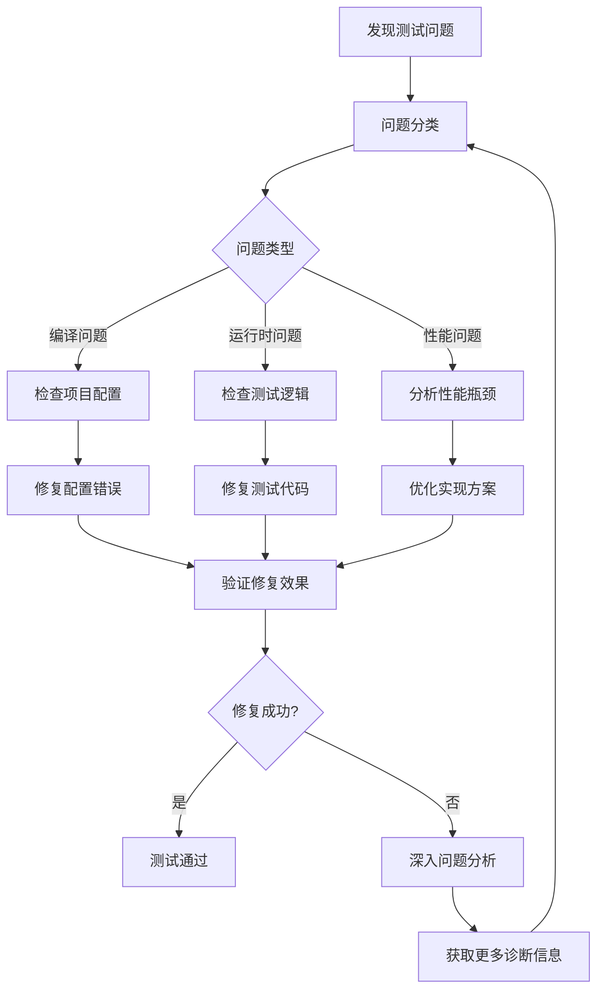

# ModbusLib 功能测试运行方案

## 概述

本文档提供 ModbusLib 项目现有测试套件的运行指南和问题解决方案。项目已具备完整的测试结构，包括单元测试、集成测试、协议测试等。本方案专注于实际测试执行过程中可能遇到的问题及其解决策略。

## 现有测试项目结构分析

### 测试项目组织架构

``mermaid
graph TD
    A[Tests/] --> B[src/]
    B --> C[AdvancedFunctions/]
    B --> D[Factories/]
    B --> E[GenericReadWrite/]
    B --> F[Integration/]
    B --> G[Protocols/]
    B --> H[ReadFunctions/]
    B --> I[WriteFunctions/]
    B --> J[TestHelper.cs]
    B --> K[TestModbusClient.cs]
    
    C --> C1[ModbusAdvancedTests.cs]
    D --> D1[ModbusClientFactoryTests.cs]
    E --> E1[GenericBasicTests.cs]
    E --> E2[GenericBoundaryTests.cs]
    E --> E3[GenericCompatibilityTests.cs]
    E --> E4[GenericPerformanceTests.cs]
    E --> E5[GenericReadWriteIntegrationTests.cs]
    E --> E6[MidLittleEndianTests.cs]
    E --> E7[ModbusDataConverterTests.cs]
    E --> E8[ModbusSpanExtensionsTests.cs]
    F --> F1[BasicClientIntegrationTests.cs]
    G --> G1[RtuProtocolTests.cs]
    G --> G2[TcpProtocolTests.cs]
    H --> H1[ModbusReadTests.cs]
    I --> I1[ModbusWriteTests.cs]
```

### 测试覆盖范围

| 测试分类 | 文件数量 | 核心功能 | 测试工具 |
|---------|---------|---------|----------|
| 泛型读写测试 | 8个文件 | 数据类型转换、字节序处理 | xUnit, FluentAssertions |
| 协议层测试 | 2个文件 | RTU/TCP协议、帧格式验证 | Mock框架 |
| 功能测试 | 3个文件 | 读取/写入/高级功能 | TestableModbusClient |
| 集成测试 | 2个文件 | 端到端通信、错误处理 | Mock对象 |
| 工厂测试 | 1个文件 | 客户端创建、配置验证 | 配置构建器 |

## 测试执行命令与操作

### 基础测试命令

```bash
# 1. 在项目根目录执行全部测试
cd D:\Projects\ModbusLib
dotnet test

# 2. 执行特定测试项目
dotnet test Tests/ModbusLib.Tests.csproj

# 3. 显示详细输出
dotnet test --verbosity detailed

# 4. 仅运行特定类的测试
dotnet test --filter "FullyQualifiedName~GenericBasicTests"

# 5. 按分类运行测试
dotnet test --filter "Category=Unit"

# 6. 生成代码覆盖率报告
dotnet test --collect:"XPlat Code Coverage"
```

### 测试结果分析命令

```bash
# 运行指定类别测试
dotnet test --filter "FullyQualifiedName~ProtocolTests"
dotnet test --filter "FullyQualifiedName~GenericReadWrite"
dotnet test --filter "FullyQualifiedName~Integration"

# 输出测试结果到文件
dotnet test --logger:trx --results-directory ./TestResults

# 并行测试执行
dotnet test --parallel
```

## 测试执行流程

``mermaid
sequenceDiagram
    participant User as 用户
    participant Test as 测试系统
    participant Build as 构建系统
    participant Report as 报告系统
    
    User->>Test: 执行 dotnet test
    Test->>Build: 检查项目编译
    
    alt 编译成功
        Build-->>Test: 编译通过
        Test->>Test: 执行单元测试
        Test->>Test: 执行集成测试
        Test->>Report: 生成测试报告
        Report-->>User: 显示测试结果
    else 编译失败
        Build-->>Test: 编译失败
        Test->>Report: 生成错误报告
        Report-->>User: 显示编译错误
    end
```

## 常见问题及解决方案

### 编译错误处理

``mermaid
flowchart TD
    A[执行 dotnet test] --> B{编译状态}
    
    B -->|成功| C[运行测试]
    B -->|失败| D[编译错误分析]
    
    D --> E[检查常见问题]
    E --> F[项目引用问题]
    E --> G[NuGet包缺失]
    E --> H[编译标符错误]
    
    F --> I[修复引用路径]
    G --> J[恢复 NuGet 包]
    H --> K[修复代码语法]
    
    I --> L[重新编译]
    J --> L
    K --> L
    
    L --> B
```

#### 编译错误解决步骤

1. **项目引用问题**
``bash
# 检查项目引用是否正确
cat Tests/ModbusLib.Tests.csproj | grep ProjectReference

# 应该显示：
# <ProjectReference Include="..\ModbusLib\ModbusLib.csproj" />

# 如果路径不正确，修正为：
# <ProjectReference Include="..\ModbusLib\ModbusLib.csproj" />
```

2. **NuGet包恢复**
```bash
# 清理和恢复依赖
dotnet clean
dotnet restore
dotnet build
```

3. **常见编译错误修复**

| 错误类型 | 错误信息 | 解决方案 |
|---------|---------|----------|
| 类型未找到 | `The type or namespace name 'ModbusLib' could not be found` | 检查项目引用路径 |
| 依赖包缺失 | `Package 'xunit' is not found` | 执行 `dotnet restore` |
| 编译目标错误 | `The target framework 'net9.0' is not supported` | 检查 .NET 9 SDK 安装 |
| 语法错误 | `Syntax error` | 检查代码语法，关注 C# 12 特性 |

### 运行时问题处理

#### 常见运行时错误

| 错误类型 | 典型症状 | 解决方案 |
|---------|---------|----------|
| 依赖项缺失 | `FileNotFoundException` | 检查 NuGet 包引用，执行 `dotnet restore` |
| 类型加载失败 | `TypeLoadException` | 验证程序集版本兼容性 |
| 内存不足 | `OutOfMemoryException` | 优化大数据测试，增加可用内存 |
| 超时异常 | `TimeoutException` | 调整测试超时配置，检查性能瓶颈 |
| Mock 对象错误 | `NullReferenceException` | 检查 Mock 设置和验证逻辑 |

#### 测试失败排查步骤

```bash
# 1. 查看详细错误信息
dotnet test --verbosity diagnostic

# 2. 单独运行失败的测试
dotnet test --filter "FullyQualifiedName=ModbusLib.Tests.GenericReadWrite.GenericBasicTests.ModbusDataConverter_GetRegisterCount_BasicTypes_ReturnsCorrectValues"

# 3. 检查测试环境
dotnet --info
dotnet list package
```

### 具体测试用例分析

#### 核心功能测试覆盖

1. **TestModbusClient 模拟客户端**
   - 提供完整的 `IModbusClient` 接口实现
   - 支持泛型读写方法测试
   - 内置数据模拟和验证机制

2. **TestHelper 工具类**
   - 提供测试常量和数据生成方法
   - 统一测试数据格式和验证逻辑
   - 支持数组转换和比较操作

#### 关键测试场景



## 性能监控与优化

### 性能基准

``mermaid
graph TD
    A[性能测试] --> B[内存使用监控]
    A --> C[执行时间测量]
    A --> D[并发性能测试]
    
    B --> E[ArrayPool 效率]
    C --> F[数据转换速度]
    D --> G[多线程安全性]
    
    E --> H[性能报告]
    F --> H
    G --> H
```

### 性能指标阈值

| 指标类别 | 测试场景 | 预期阈值 | 监控方法 |
|---------|---------|---------|---------|
| 内存分配 | 大数组转换 | < 100MB | `GC.GetTotalMemory()` |
| 执行时间 | 单次转换 | < 1ms | `Stopwatch` |
| 并发处理 | 100个并发请求 | < 500ms | 负载测试 |

## 测试环境配置

### 必需环境



### 配置验证清单

- [ ] .NET 9 SDK 已安装
- [ ] 项目依赖已恢复（`dotnet restore`）
- [ ] 测试项目引用正确
- [ ] xUnit 测试运行器可用
- [ ] Moq 和 FluentAssertions 包已安装

## 自动化测试集成

### CI/CD 集成流程



### 测试命令集

| 命令 | 用途 | 示例 |
|------|------|------|
| 基础测试 | `dotnet test` | 执行全部测试 |
| 分类测试 | `dotnet test --filter Category=Unit` | 执行特定分类 |
| 详细输出 | `dotnet test --verbosity detailed` | 显示详细信息 |
| 覆盖率测试 | `dotnet test --collect:"XPlat Code Coverage"` | 生成覆盖率报告 |

## 测试结果分析

### 结果解读矩阵



### 常见失败模式

| 失败模式 | 特征 | 根因分析 | 解决策略 |
|---------|------|---------|---------|
| 数据转换错误 | 字节序不匹配 | 端序配置错误 | 验证 `ModbusEndianness` 配置 |
| 协议测试失败 | CRC校验失败 | 帧格式错误 | 检查 RTU 协议实现 |
| 性能测试超时 | 执行时间过长 | 算法效率问题 | 优化数据处理逻辑 |
| 集成测试失败 | 模拟数据不匹配 | 测试数据设置 | 调整 `TestModbusClient` 配置 |

## 问题解决工作流


```

```

```
